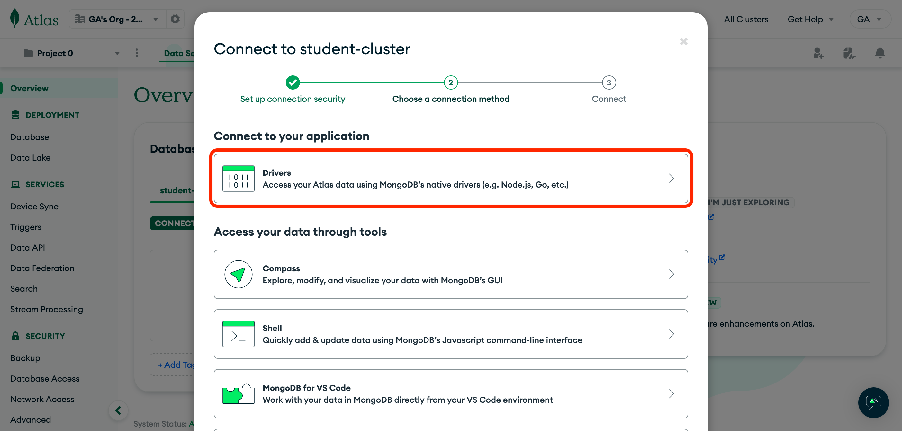
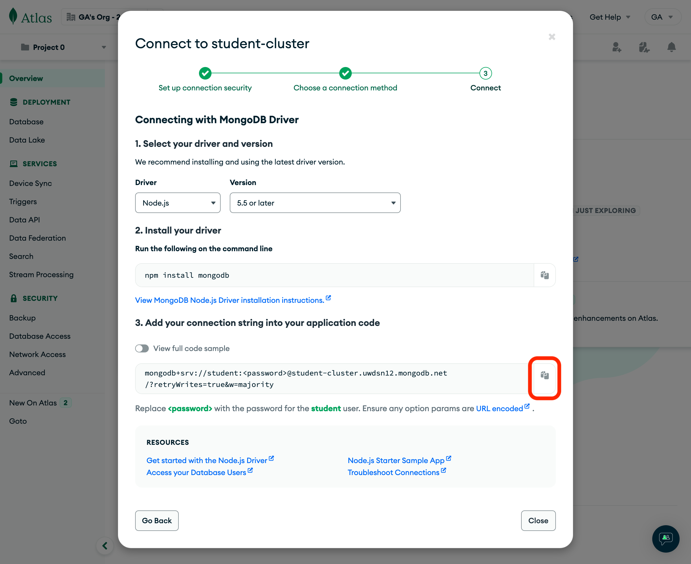

# Mongoose Review


## Description

A short and quick application built to review what we have learned so far regarding Node/Express and Mongoose.


## Getting Started

- **Fork** and **Clone** this repository
- `cd` into the newly cloned directory
- `code .` to open in VS Code


## Setting Up Our Node Environment

First off, we will need to initialize our Node environment so that we can run our server and install and utilize various libraries and packages. In order to do this, we'll run the following command in our terminal:

```sh
npm init -y
```

The `-y` ensures that `yes` is answered to all of the default setup questions.

When this completes, we see a `package.json` file generated in our project directory. This is the "instructions" for our application. It contains important info, and eventually will contain a list of packages that are necessary for our app to run.


## Installing Necessary Packages

Let's install a few things we're going to need. In your terminal:

```sh
npm install express morgan dotenv mongoose
```

Let's break each of these down:

- `express` - a library that will give us tools to run back-end server software
- `morgan` - a library that gives us useful "logging" in our terminal when the request/response cycle occurs
- `dotenv` - a library that allows our JavaScript files to extract environment variables from a `.env` file
- `mongoose` - a library that enables us to set up Schema structures and provides methods for performing CRUD operations on our MongoDB database

Once these installs complete, you should see them listed alongside their version numbers in the `"dependencies"` key of your `package.json` file.  A `node_modules` folder and a `package-lock.json` file will also be generated. 


## Ensuring Git Ignores Certain Files/Folders

Next, we'll need to make sure that things like our node_modules folder do not get tracked by git as we work on our project. In your terminal:

```sh
touch .gitignore
```

Anything we put in this file will not be tracked by git.

For now, put:

```txt
/node_modules
package-lock.json
```


## Setting Up Our Express Server

We need a file to set up our Express server. By convention, we'll create a `server.js` file in the root of our directory.

```sh
touch server.js
```

In this file, we'll import the express library.

```js
const express = require('express')
```

We also want to import and set up Morgan for logging.

```js
const logger = require('morgan')
```

Now that we've imported these two libraries, we need to put them to use. Below your imports:

```js
const app = express()

app.use(logger('dev'))
```

Let's also set up a base route with a simple response.

```js
app.use('/', (req, res) => {
  res.send('Our app is connected . . . ')
})
```

Finally, at the bottom of the file, let's listen on a certain port for our server to receive requests.

```js
app.listen(3000, () => {
  console.log("Running Server on Port 3000 . . . ")
})
```

`server.js` file should look like this so far:

```js
const express = require('express')
const logger = require('morgan')

const app = express()

app.use(logger('dev'))

app.use('/', (req, res) => {
  res.send('Our app is connected . . . ')
})

app.listen(3000, () => {
  console.log("Running Server on Port 3000 . . . ")
})
```


## Running and Testing Our Server

Now that our basic Express server is set up to run, we need to test it out.

In our `package.json` file, let's add a script to run our server:

```json
"scripts": {
  "test": "echo \"Error: no test specified\" && exit 1",
  "start": "node --watch server.js"
},
```

You can use `node -watch` OR `nodemon`. Both do the same thing, but `nodemon` requires another library to execute, while node has the functionality already built in. It is your preference. For `nodemon`, it would look like this:

```json
"scripts": {
  "test": "echo \"Error: no test specified\" && exit 1",
  "start": "nodemon server.js"
},
```

After our script is set up, we can run our server. In your terminal:

```sh
npm start
```

You should see `"Running Server on Port 3000 . . . "` in your terminal output. Now let's make a request to `http://localhost:3000/` with Insomnia to test our base route.

The response you get should be `Our app is connected . . . `.

For now, let's stop our server buy pressing <kbd>Ctrl</kbd> + <kbd>C</kbd>.


## Connecting Our MongoDB Database

### Environment Variables

First, let's set up a file where we can hide secure information - a `.env` file.

In terminal:

```sh
touch .env
```

We definitely don't want to push this file to GitHub, so let's immediately add it to the bottom of our `.gitignore` file.

```txt
/node_modules
package-lock.json
.env
```

Leave the `.env` file empty for now.


### Getting Our Connection String

We need to allow our server to access our database on MongoDB Atlas. To do this, we will always need our secure connection string. 

To access this, sing in to Atlas.

Once you arrive on the Overview page, click the Connect button as shown below:


Select the only option under the Connect to your application header, Drivers:



Click the copy button to add the connection string to your clipboard. You do not need to do anything else on this page.




### Setting Up the **.env** File

We will take this string and paste it into our `.env` file under the variable name `MONGODB_URI`. Like this:

```txt
MONGODB_URI=mongodb+srv://your_username:<db_password>@cluster_name.qscuy.azure.mongodb.net/?retryWrites=true&w=majority&appName=cluster_name
```

Yours may look completely different than the example above due to the host and region you selected on setup, and that is fine. We need to replace `<db_password>` with our database password. Replace the `< >` as well.

A few of the query parameters at the end are not completely necessary and can be removed also.

```txt
&w=majority
&appName=cluster_name
```

Save your `.env` file. If you left your server running, you'll need to restart it now. Your server always needs to restart after changes to the `.env` file.


### Connecting to the DataBase

In our terminal, let's create a `db` directory.

```sh
mkdir db
```

In this directory, we'll need an `index.js` file.

```sh
touch ./db/index.js
```

We'l use this file to establish a connection to our database with `mongooose`.

At the top of the file, we'll import `mongoose`.

```js
const mongoose = require('mongoose')
```

We also need to bring in `dotenv` to allow us to extract and utilize our database connection string. We require it and immediately invoke the `config()` method. No need to store it in a variable.

```js
require('dotenv').config()
```

Now, let's set up an *asynchronous* function to attempt connection with our database.

```js
const connect = async () => {

}
```

In this function, we want to set up a `try/catch` block to properly handle any errors that might occur during connection.

```js
const connect = async () => {
  try {

  } catch (error) {

  }
}
```

We'll use Mongoose's built in `connect` method to establish our connection then console log the success. In the catch block, we'l simply console.log any errors that occur.

```js
const connect = async () => {
  try {
    await mongoose.connect(process.env.MONGODB_URI)
    console.log('Successfully connected to MongoDB database . . .')
  } catch (error) {
    console.error('Connection Error!', error.message)
  }
}
```

Now, we invoke the function we made:

```js
connect()
```

Finally, we simply export the Mongoose connection.

```js
module.exports = mongoose.connection
```

In order for this to occur when we run our server, we just need to require this file at the top of our `server.js`. This will run the file, and execute our `connect()` function.

In `server.js`, just below our other imports...

```js
const db = require('./db')
```

Now, we run our server and watch our database connection occur!

```sh
npm start
```

We should now see:

```txt
Running Server on Port 3000 . . . 
Successfully connected to MongoDB database . . .
```


## Creating a Mongoose Model with the Schema Class

One of the things that Mongoose allows us to do is to set up templates or *schemas* for our MongoDB documents to follow. This ensures that each record is inserted in the database in a designated way, preventing errors. This takes a non-relational / noSQL database, and gives it many of the advantages of a relational / SQL database. It's the best of both worlds!

Let's start off by making a `models` directory.

```sh
touch models
```

In this folder, we'll create a file for the particular resource we want a schema for. For this app, we'll call it `task.js`. By convention, when we name this file, the resource is **singular** since it represents the template we will follow for a *single* document.

```sh
touch ./models/task.js
```

In this file, we'll need access to the mongoose object so let's import that.

```js
const mongoose = require('mongoose')
```

Now, we'll need a new instance of the *Schema class* from Mongoose. In JavaScript, classes can be used to create reusable objects that all share similar properties and methods (built-in functions).  Mongoose uses this to create a new model for us. By convention, the name of this variable will be our resource + Schema to clearly designate it.

```js
const taskSchema = new mongoose.Schema({

})
```

The *new* keyword says to JavaScript that we want a brand new object generated from the mongoose.Schema class. When this happens, what we get back has all the properties and methods available to Schemas in Mongoose. 

Inside of this, we simply need to pass in a few options to set up our model. We want to tell it the different key/value pairs we want and the datatypes that we expect them to be.

For our Task model, let's create a `"text"` field that will show the actual task we want to get done (i.e.: "Clean Our Room") and an `"isComplete"` field that we can update with the current status of that task. Notice that the datatype options are capitalized.

```js
const taskSchema = new mongoose.Schema({
  text: String,
  isComplete: Boolean
})
```

Then, we need to use Mongoose's model() method to turn our regular schema into a true model, giving it much more abilities! We do that with this line:

```js
const Task = mongoose.model('Task', taskSchema)
```

By convention, the first argument to this method will be a *PascalCased* string of our collection name - in this case, `"Task"`. The second argument is the `taskSchema` variable from above.

Now we export it so that we can utilize it elsewhere in our app.

```js
module.exports = Task
```

Our model is now ready to be used to perform CRUD operations on our database!


## Setting Up CRUD Operations

In a real application, we will be setting up `routes` and `controllers` directories to store and index various endpoints (routes) our client can hit and the associated functions (controllers) to perform. This is in a coming lesson.  For now, we will set up functions in our `server.js` file so we can simulate the process and test it out.

In `server.js`, let's open up several lines between logger (`app.use(logger('dev'))`) and our base route (`app.use('/', . . .`).


### Writing A Function to Create a Resource

Let's set up a basic POST route that will create a new task in our database.

```js
app.post('/tasks', () => {

})
```

`.post()` accepts in two arguments - 1) the route to be hit 2) the function that invokes when it's hit.  Later, this route and function will be defined elsewhere for organization and then exported/imported to where we need it.

With all "controller" functions in Express, we get the `req` and `res` objects as arguments.

Since we're going to be interacting with our database, this function will need to be `async` as well.

```js
app.post('/tasks', async (req, res) => {

})
```

Next, we're going to import our model we created at the top of our file so that we can use it to interact with our collection in MongoDB. At the top, just under our other imports...

```js
const express = require('express')
const logger = require('morgan')

const Task = require('./models/task.js')
```

Now we can use this `Task` model to create new documents in our database. Back in our function...

```js
app.post('/tasks', async (req, res) => {
  const newTask = await Task.create()
})
```

We'll store what gets sent back from the database in a new variable called `newTask`. The `create()` method accepts an argument of an object that matches the schema we made! For testing, we'll hardcode in values that will represent our new task we are adding, but eventually this will be our `req.body` (values entered into a form by our client).

```js
app.post('/tasks', async (req, res) => {
  const newTask = await Task.create({
    text: "Clean Our Room",
    isComplete: false
  })
})
```

*Remember that the values for these properties have to match the datatype expected in our Schema!*

Next, let's send the `newTask` we get back in the `response`.

```js
app.post('/tasks', async (req, res) => {
  const newTask = await Task.create({
    text: "Clean Our Room",
    isComplete: false
  })
  res.send(newTask)
})
```

Start up our server and make sure you've connected to your MongoDB database.

```sh
npm start
```

Should see...

```txt
Running Server on Port 3000 . . . 
Successfully connected to MongoDB database . . .
```

Now, open Insomnia and let's send a post request to this route (`http://localhost:3000/tasks`). No need to place anything in the request body just yet.

You should see something similar to:

```json
{
	"text": "Clean Our Room",
	"isComplete": false,
	"_id": "680f579cffedce3c2d3c074c",
	"__v": 0
}
```

This document now exists in our database's `tasks` collection!


### Writing A Function to Read a Resource

Let's set up a basic GET route that will get this new task from our database by utilizing it's automatically generated `ObjectID`.

Same pattern as the last one, except this time we'll use the `get()` method. Our route, following RESTful Routing conventions, will be `/tasks/:id`.

```js
app.get('/tasks/:id', async (req, res) => {

})
```

We'll use this route `param` to take whatever ID the client sends us and query the database for that specific document by using the `findById` method available on our Mongoose model. We'll store the document we get back in a variable called `task`, then send it in the response.

```js
app.get('/tasks/:id', async (req, res) => {
  const task = await Task.findById()
  res.send(task)
})
```

`findById` accepts one argument, and it must be a MongoDB ObjectID. We'll extract ours from the route `param` with `req.params.id`.

```js
app.get('/tasks/:id', async (req, res) => {
  const task = await Task.findById(req.params.id)
  res.send(task)
})
```

Make sure your server is running and database is connected. Then, open Insomnia and let's send a GET request to `http://localhost:3000/tasks/<ObejctID>`. You'll need to copy the ObjectID from the document you created in the last step and paste it into the route!

You should receive back your document from before!

```json
{
	"_id": "680f579cffedce3c2d3c074c",
	"text": "Clean Our Room",
	"isComplete": false,
	"__v": 0
}
```


## You Do

1) Utilize the `.find()` method available on our Mongoose model and create a route and function that queries our database for all documents in our `tasks` collection. The response will return an `array` automatically.

2) Create a PUT route and function to find a document by ID and update it's `isComplete` value. Use the built-in `.findByIdAndUpdate()` method.

3) Create a DELETE route and function to find a document by ID and remove it from the database. Use `.findByIdAndDelete()`.

The [Mongoose documentation](https://mongoosejs.com/docs/queries.html) may be helpful if you aren't sure how these methods will work!


## Recap

In this lesson, we learned how to set up a Node/Express server from scratch, how to create new models using the Mongoose Schema class, and how to write simple functions to perform CRUD operations on our database.  As our Node/Express applications grow in scale and get more complex in structure, these core principles will remain the same.


## Resources

- [Node Docs](https://nodejs.org/docs/latest/api/)
- [Express Docs](https://expressjs.com/)
- [Mongoose Docs](https://mongoosejs.com/docs/guide.html)
- [morgan](https://www.npmjs.com/package/morgan)
- [dotenv](https://www.npmjs.com/package/dotenv)


